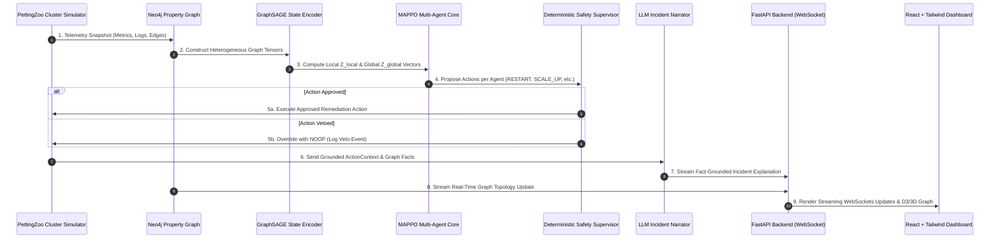

# Aegis: First-Principles Educational Guide & Architecture Deep-Dive

Welcome to the comprehensive learner's guide to **Aegis**! This document breaks down the entire system from **first principles**—assuming no prior advanced knowledge of Reinforcement Learning, Graph Neural Networks, or Kubernetes.

---

## Table of Contents
1. [Part 1: The Core Problem Statement (First Principles Formulation)](#part-1-the-core-problem-statement-first-principles-formulation)
   - [What is a Cloud Infrastructure Incident?](#what-is-a-cloud-infrastructure-incident)
   - [Deconstructing the Problem from First Principles](#deconstructing-the-problem-from-first-principles)
   - [Why Traditional Approaches Fail](#why-traditional-approaches-fail)
   - [The First-Principles Solution: Aegis](#the-first-principles-solution-aegis)
2. [Part 2: Core Concepts, Technologies & Algorithms Explained](#part-2-core-concepts-technologies--algorithms-explained)
   - [1. Infrastructure Layer: Kubernetes & Microservices](#1-infrastructure-layer-kubernetes--microservices)
   - [2. Knowledge Representation: Property Graphs & Neo4j](#2-knowledge-representation-property-graphs--neo4j)
   - [3. Deep Learning on Graphs: Graph Neural Networks (GNNs) & GraphSAGE](#3-deep-learning-on-graphs-graph-neural-networks-gnns--graphsage)
   - [4. Decision Making: Multi-Agent Reinforcement Learning (MARL) & MAPPO](#4-decision-making-multi-agent-reinforcement-learning-marl--mappo)
   - [5. Safety & Explanation: Agentic LLMs & Deterministic Guardrails](#5-safety--explanation-agentic-llms--deterministic-guardrails)
3. [Part 3: End-to-End System Pipeline & Information Flow](#part-3-end-to-end-system-pipeline--information-flow)
4. [Part 4: Key Learnings & Resume/Portfolio Takeaways](#part-4-key-learnings--resumeportfolio-takeaways)

---

## Part 1: The Core Problem Statement (First Principles Formulation)

### What is a Cloud Infrastructure Incident?

Imagine an online shopping platform like Amazon or Swiggy. When a user clicks **"Buy Now"**, their request does not go to a single giant computer. Instead, it travels through dozens of smaller interconnected software services:

```
[User App] ──> [API Gateway] ──> [Order Service] ──> [Payment Service] ──> [Database]
                                       │
                                       └──> [Inventory Service]
```

These small services are called **Microservices**, and they run inside lightweight virtual environments called **Pods** on physical software servers called **Nodes**.

Now, imagine `Payment Service` experiences a sudden memory leak and crashes.
1. `Order Service` waits for `Payment Service` to reply, but gets a timeout.
2. Requests start piling up in `Order Service`'s memory queue.
3. `Order Service` runs out of memory and also crashes.
4. `API Gateway` gets flooded with errors, bringing down the entire website for millions of users.

This domino effect is called a **Cascading Failure**.

---

### Deconstructing the Problem from First Principles

To solve a complex problem, we break it down into its fundamental physical and logical truths (First Principles):

#### Fundamental Truth 1: High Dimensionality & Topological Structure
* Software applications are **non-linear graphs**, not flat spreadsheets. 
* A cluster has $N$ services, $M$ dependencies, $P$ pods, and $K$ nodes. The total state space contains hundreds of continuous metrics (CPU utilization, memory usage, network packet drop, queue length, request latency).

#### Fundamental Truth 2: Cascading Temporal Dynamics
* Failures propagate across time and dependency links. A failure at node $A$ at time $t$ manifests as an error at node $B$ at time $t+k$.

#### Fundamental Truth 3: Partial Observability
* No single component has full visibility into the whole system. A local service only sees its own incoming and outgoing traffic.

#### Fundamental Truth 4: Human Cognition Bottleneck
* When an incident occurs, human SREs (Site Reliability Engineers) receive dozens of noisy alerts.
* Reading logs, querying metrics, isolating root causes, and executing manual fix scripts (`kubectl restart`, `kubectl scale`) takes **15 to 45 minutes**.
* Every minute of downtime costs enterprise companies thousands of dollars.

---

### Why Traditional Approaches Fail

1. **Static Alert Thresholds** (e.g., *"Alert if CPU > 80%"*):
   - Cause **Alert Fatigue**. During a cascade, 50 alerts trigger at once. SREs don't know which one is the root cause and which ones are side effects.
2. **Hardcoded Rule Scripts** (e.g., *"If payment service fails, restart it"*):
   - Infrastructure changes constantly. When pods autoscale from 5 to 50, static scripts break or cause resource contention.
3. **Pure LLM Prompts** (e.g., *"Ask ChatGPT to fix the cluster"*):
   - Unconstrained LLMs suffer from **Hallucinations** (inventing non-existent log errors) and lack real-time mathematical optimization guarantees.

---

### The First-Principles Solution: Aegis

Aegis answers the fundamental question: **"How can an autonomous software system continuously observe a complex dynamic graph, learn optimal self-healing actions without human delay, guarantee safety, and explain its actions?"**

```
+-----------------------------------------------------------------------------------+
|                                  AEGIS SOLUTION                                   |
+-----------------------------------------------------------------------------------+
|  1. OBSERVE   |  Store live topology in a Neo4j Property Graph                    |
|  2. ENCODE    |  Convert graph into vector embeddings using Graph Neural Networks |
|  3. DECIDE    |  Select optimal action per service using Multi-Agent RL (MAPPO)   |
|  4. GUARD     |  Filter dangerous actions through a Deterministic Safety Veto     |
|  5. NARRATE   |  Explain root cause using a Fact-Grounded LLM Narrator            |
+-----------------------------------------------------------------------------------+
```

---

## Part 2: Core Concepts, Technologies & Algorithms Explained

### 1. Infrastructure Layer: Kubernetes & Microservices

* **Container**: A lightweight package containing software code and all its dependencies so it runs identically on any machine.
* **Pod**: The smallest deployable unit in Kubernetes, hosting one or more containers.
* **Service**: A logical grouping of pods that exposes a unified network endpoint (e.g., `payment-service`).
* **Node**: A physical or virtual machine in the cluster that hosts pods.
* **PettingZoo**: A standard Python library for multi-agent reinforcement learning environments (similar to OpenAI Gym, but for multiple agents acting simultaneously).

---

### 2. Knowledge Representation: Property Graphs & Neo4j

#### What is a Property Graph?
Traditional relational databases (SQL) store data in flat tables with rows and columns. When systems have complex relationships, SQL requires expensive `JOIN` operations.

A **Property Graph** represents data directly as:
* **Nodes** (Entities): e.g., `:Service`, `:Pod`, `:Node`.
* **Relationships** (Edges): e.g., `(:Pod)-[:RUNS_ON]->(:Node)`, `(:Service)-[:DEPENDS_ON]->(:Service)`.
* **Properties** (Key-Value pairs): e.g., `p99_latency_ms: 240`, `cpu_pct: 88.5`.

#### Why Neo4j?
Neo4j is an enterprise graph database. Aegis uses **Cypher** (Neo4j's query language) to ingest telemetry in real time:

```cypher
// Real Cypher query used in Aegis ingestion
MERGE (s:Service {id: $service_id})
SET s.health = $health, s.p99_latency_ms = $latency
```

---

### 3. Deep Learning on Graphs: Graph Neural Networks (GNNs) & GraphSAGE

#### The Problem with Standard Neural Networks
Standard Deep Learning (MLPs, CNNs) expects fixed-size inputs like regular grid images ($28 \times 28$ pixels) or fixed vectors. But a Kubernetes cluster graph changes constantly—pods scale up, pods crash, new edges appear.

#### What is a GNN?
A **Graph Neural Network (GNN)** learns representations of graph nodes by passing "messages" along connecting edges.

```
       [Node B] ──(Message)──┐
                             v
       [Node C] ──(Message)──> [Node A] ──> Updated Embedding for A
                             ^
       [Node D] ──(Message)──┘
```

#### GraphSAGE (Sample and Aggregate)
**GraphSAGE** is an *inductive* GNN algorithm. Instead of memorizing fixed node IDs, it learns a general function to aggregate features from a node's local neighborhood:

$$h_v^{(k)} = \sigma \left( W \cdot \operatorname{AGGREGATE}_k \left( \{ h_u^{(k-1)}, \forall u \in \mathcal{N}(v) \} \right) \right)$$

Where:
* $h_v^{(k)}$ is the feature embedding of node $v$ at step $k$.
* $\mathcal{N}(v)$ is the set of neighbor nodes connected to $v$.
* $\operatorname{AGGREGATE}$ computes the mean or max pool of neighbor vectors.

**Why this matters in Aegis**: When `payment-service` scales from 2 pods to 10 pods, GraphSAGE can immediately compute feature vectors without needing to retrain the neural network!

---

### 4. Decision Making: Multi-Agent Reinforcement Learning (MARL) & MAPPO

#### Reinforcement Learning Basics
In Reinforcement Learning (RL), an **Agent** learns to make decisions by interacting with an **Environment**:
1. Agent observes state $S_t$.
2. Agent selects action $A_t$.
3. Environment transitions to $S_{t+1}$ and yields a numerical **Reward** $R_t$.
4. The goal is to maximize cumulative future rewards ($\sum \gamma^t R_t$).

```
                ┌──────────────┐
                │    Agent     │
                └──────┬───────┘
                       │ Action A_t
                       v
                ┌──────────────┐
                │ Environment  │
                └──────┬───────┘
                       │ State S_{t+1}, Reward R_t
                       v
```

#### Why Multi-Agent (MARL)?
In a cluster with 12 microservices, having a single central brain pick joint actions for all 12 services leads to an **exponential action explosion** ($6^{12} = 2.17 \times 10^9$ choices per tick!).

In **MARL**, each microservice has its own local agent. Each agent selects an action from a small discrete choice set:
$$\mathcal{A} = \{\text{NOOP}, \text{RESTART}, \text{SCALE\_UP}, \text{SCALE\_DOWN}, \text{ISOLATE}, \text{REROUTE}\}$$

#### MAPPO (Multi-Agent Proximal Policy Optimization) & CTDE
Aegis uses **CTDE (Centralized Training with Decentralized Execution)**:
* **Centralized Training (The Critic)**: During offline training in simulation, a shared Critic network looks at the *global cluster embedding* $Z_{\text{global}}$ to evaluate how well the team of agents is doing.
* **Decentralized Execution (The Actors)**: During live execution, each local Actor head looks *only* at its local node embedding $Z_{\text{local}}$ to make instant decisions in milliseconds without waiting for global synchronization.

```
TRAINING TIME (Centralized Critic):
[Global Graph State Z_global] ──> [Centralized Critic V(S)] ──> Evaluates Team Performance

RUNTIME EXECUTION (Decentralized Actors):
[Local Service State Z_local_i] ──> [Local Actor Head i] ──> Action A_i (e.g., RESTART)
```

#### Multi-Component Uncollapsed Reward Shaping
A core non-negotiable rule in Aegis: **never collapse reward signals into a single mysterious number**. The reward is logged as separate terms:

$$\text{Reward} = R_{\text{SLA}} + R_{\text{Availability}} + R_{\text{ActionCost}} + R_{\text{InvalidAction}} + R_{\text{Terminal}}$$

* **$R_{\text{SLA}}$**: Penalty for latency violations.
* **$R_{\text{Availability}}$**: Shortfall penalty ($1 - \text{mean\_health}$).
* **$R_{\text{ActionCost}}$**: Charge per active action to prevent constant flipping ("action churn").

---

### 5. Safety & Explanation: Agentic LLMs & Deterministic Guardrails

#### The Safety Veto Layer ("RL decides, Supervisor validates")
An RL policy explores by trying random actions during training. In production, an RL agent might try to restart a core database during peak traffic!

To prevent disaster, Aegis places a **Deterministic Safety Supervisor** between the RL agent and the cluster:

```
[MAPPO Agent] ──> Proposed Action: RESTART database-primary
                        │
                        v
          [Safety Supervisor Veto Layer]
           - Protected Maintenance Window? YES
           - Critical Infrastructure Node? YES
                        │
                        ├──> [VETO DETECTED] ──> Execution Blocked! (Substituted with NOOP)
```

#### Fact-Grounded LLM Narrator
When an incident occurs or a veto is triggered, human operators need clear explanations. Aegis feeds verified telemetry facts into an LLM (via **Gemini API** or local **Ollama**):

```text
PROMPT CONSTRAINTS:
"You are the Aegis SRE Incident Narrator.
Pass-through Context: Service 'payment-service' crashed at tick 142. Dependency link to 'order-service' latency spiked to 450ms.
RULE: You MUST cite ONLY the provided graph facts. Do NOT invent unverified causes."
```

---

## Part 3: End-to-End System Pipeline & Information Flow



---

## Part 4: Key Learnings & Resume/Portfolio Takeaways

If you are showcasing Aegis to interviewers or potential employers, here are the key concepts you can discuss:

1. **Full-Stack AI Engineering**: Aegis spans the full spectrum of modern AI systems—from graph databases (Neo4j) to deep learning (PyTorch Geometric), multi-agent reinforcement learning (MAPPO CTDE), LLM ops (Ollama/Gemini adapter pattern), and streaming web interfaces (FastAPI + React).
2. **Clean Seams & Architectural Discipline**: The system maintains strict layer boundaries: `simulator/` $\to$ `graph/` $\to$ `encoder/` $\to$ `marl/` $\to$ `ops_layer/` $\to$ `backend/` $\to$ `frontend/`.
3. **Enterprise AI Safety Patterns**: Aegis demonstrates how to safely deploy probabilistic RL and generative LLM models into critical infrastructure using deterministic guardrail layers and uncollapsed reward auditing.

---
*Document created for Aegis learners and developer onboarding.*
