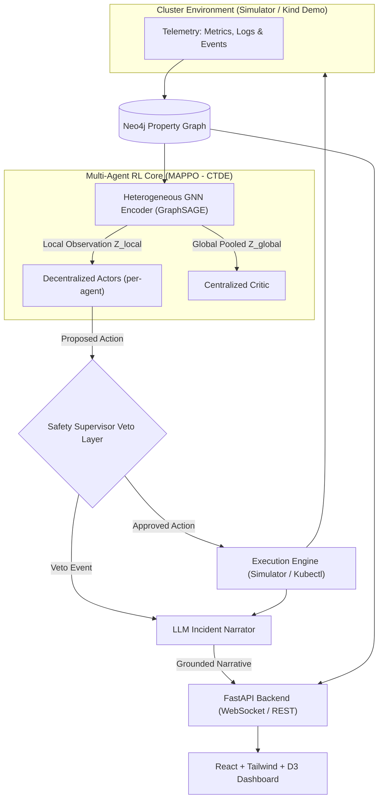

# Aegis — Technical Architecture & System Mechanics

Aegis is a multi-agent reinforcement learning (MARL) system for autonomous Kubernetes cluster self-healing. It combines a dynamic property graph, an inductive Graph Neural Network (GNN) state encoder, centralized-training decentralized-execution (CTDE) MAPPO agents, an agentic LLM ops layer with safety veto, a FastAPI streaming backend, and a custom React + D3 operations dashboard.

---

## 1. High-Level Architecture & End-to-End Pipeline

### Data Flow Sequence
1. **Telemetry & Graph Sync**: The cluster environment emits per-tick metrics and topology snapshots into Neo4j.
2. **Inductive GNN Encoding**: GraphSAGE aggregates node neighborhoods into fixed-size local embeddings $Z_{\text{local}} \in \mathbb{R}^{64}$ for individual agent observations and a pooled global embedding $Z_{\text{global}} \in \mathbb{R}^{128}$ for the critic.
3. **Decentralized Action Selection**: Independent policy actor heads select actions (`NOOP`, `RESTART`, `SCALE_UP`, `SCALE_DOWN`, `ISOLATE`, `REROUTE`).
4. **Safety Veto Evaluation**: The Safety Supervisor evaluates the proposed action against deterministic policy rules and optional LLM semantic rules.
5. **Execution & Fact-Grounded Narration**: Approved actions execute against the cluster; the LLM narrator generates explanations citing strictly verified graph facts.
6. **Streaming Visualization**: State snapshots, actions, vetoes, and narratives are broadcast via FastAPI WebSockets to the D3 force-directed dashboard.

---

## 2. Layer-by-Layer Technical Mechanics

### Layer 1: Simulated Cluster Engine (`simulator/`)
* **API Standard**: Implements the PettingZoo `ParallelEnv` standard (`reset`, `step`, `observation_space`, `action_space`), enabling direct compatibility with standard MARL frameworks.
* **Topology Generator (`topology_generator.py`)**: Generates realistic multi-tier microservice DAG topologies featuring API Gateways, Frontend services, Middleware processing services, and Databases with configurable replica counts and physical node placements.
* **Physics & Telemetry Engine (`cluster_env.py`)**:
  * Simulates CPU/memory utilization, request queuing, network latency, error propagation, and SLA threshold violations at vector speed (up to ~9,600 agent steps/sec).
  * State transitions update pod lifecycle states (`Running`, `NotReady`, `Restarting`, `CrashLoopBackOff`).
* **Fault Injection Framework (`fault_injection.py`)**:
  * **`POD_CRASH`**: Immediate pod death causing capacity drop and traffic overload on remaining replicas.
  * **`NODE_SPIKE`**: CPU/memory resource exhaustion across all pods running on a specific node.
  * **`NETWORK_PARTITION`**: Dependency edge disconnection resulting in 100% packet loss and timeout cascades.
  * **`CASCADING_LATENCY`**: Downstream queue saturation causing upstream request backpressure.
* **Deterministic Reproducibility**: Environment steps are fully seedable, ensuring identical fault scenarios during MAPPO vs. baseline comparisons.

---

### Layer 2: Real-time Neo4j Knowledge Graph (`graph/`)
* **Property Graph Schema (`graph/schema.cypher`)**:
  * **Nodes**: `:Service`, `:Pod`, `:Node`.
  * **Relationships**:
    * `(:Service)-[:DEPENDS_ON]->(:Service)`
    * `(:Pod)-[:INSTANCE_OF]->(:Service)`
    * `(:Pod)-[:RUNS_ON]->(:Node)`
    * `(:Service)-[:CALLS {p99_latency_ms, error_rate, traffic_share}]->(:Service)`
* **Multi-Tenant Identity Isolation**: Uses composite key `(run_id, id)` allowing simultaneous dev streams, unit tests, and eval sweeps on a single Neo4j database without collisions.
* **Idempotent Ingestion Pipeline (`ingestion_pipeline.py`)**:
  * Executes vectorized Cypher `MERGE` queries (`NodeUniqueIndexSeek`).
  * Index-anchored stale-element sweeps clean up dead pods and removed edges without triggering full-label table scans.
* **Database Migrations (`graph/migrations/`)**: All schema evolution steps are managed via numbered migration scripts verified by checksum assertions.

---

### Layer 3: Inductive Heterogeneous GNN Encoder (`encoder/`)
* **Inductive GraphSAGE Architecture (`gnn_model.py`)**: Chosen over GAT because Kubernetes pod counts change dynamically during scaling and crash events. GraphSAGE learns neighborhood aggregation functions rather than node-indexed matrices, allowing zero-shot generalization across graphs of arbitrary size.
* **Heterogeneous Message Passing**:
  1. **Typed Input Encoders**: Separate `Linear -> LayerNorm -> ReLU` projections map `:Service`, `:Pod`, and `:Node` raw feature vectors into a unified 64-dimensional hidden space.
  2. **Relation-Specific Convolutions**: `torch_geometric.nn.HeteroConv` wraps custom `SAGEConvWithEdgeAttr` instances across 8 directed relation types (4 forward relations + 4 reverse relations).
  3. **Dual Output Representations**:
     * **Local Agent Observation ($Z_{\text{local}} \in \mathbb{R}^{64}$)**: Output embedding for each individual node.
     * **Global Critic Embedding ($Z_{\text{global}} \in \mathbb{R}^{128}$)**: Concatenation of mean-pooled and max-pooled representations across node types.
* **Linear Probe Validation (`encoder/probe.py`)**: Validates representation quality in isolation before RL training by predicting node health states via logistic regression over frozen GNN embeddings.

---

### Layer 4: Multi-Agent RL Core (MAPPO) (`marl/`)
* **Framework Architecture**: Hand-rolled Centralized-Training Decentralized-Execution (CTDE) MAPPO in PyTorch using Generalized Advantage Estimation (GAE).
* **Discrete Action Space**:
  $$\mathcal{A} = \{0: \text{NOOP}, 1: \text{RESTART}, 2: \text{SCALE\_UP}, 3: \text{SCALE\_DOWN}, 4: \text{ISOLATE}, 5: \text{REROUTE}\}$$
* **Network Structures**:
  * **Decentralized Actor**: Independent policy head taking local embedding $Z_{\text{local}}$ and producing categorical action distributions.
  * **Centralized Critic**: Shared value network evaluating global embedding $Z_{\text{global}}$ to estimate state value $V(s)$.
* **Multi-Component Uncollapsed Reward Shaping (`reward.py`)**:
  * Overrides environment default weights (`RewardConfig.env_weight_overrides`) so unit signals are received.
  * **SLA Violation**: $-w_{\text{sla}} \cdot \text{sla\_rate}$ (primary dense penalty).
  * **Availability Shortfall**: $-w_{\text{avail}} \cdot (1 - \text{mean\_health})$ (re-baselined to $\le 0$ so remaining unhealthy costs points; prevents survival reward hacking).
  * **Action Cost**: Charged per active intervention to discourage action churn.
  * **Invalid Action**: Charged when an illegal action is attempted.
  * **Terminal Bonus**: $+w_{\text{rec}}$ sparse reward granted on full cluster recovery within step budget.
  * **Independent Logging**: Every reward component is logged separately in `metrics.jsonl`.
* **Baseline Benchmarking (`baseline.py`)**: Threshold-triggered rule-based controller for rigorous head-to-head comparisons on Time-to-Recovery (TTR) and SLA violation rates.

---

### Layer 5: Agentic LLM Ops & Safety Supervisor (`ops_layer/`)
* **`LLMClient` Adapter Protocol (`llm_client.py`)**: Provides a unified interface supporting local **Ollama** models for dev/testing and **Google Gemini API** for production/demos.
* **Structured Log Parser (`log_parser.py`)**: Parses unstructured container logs into typed graph update events.
* **Grounded Incident Narrator (`narrator.py`)**:
  * Accepts an `ActionContext` containing verified graph metrics and edge states.
  * Prompt instructions strictly forbid inventing causes: narrations must cite *only* passed graph facts.
* **Deterministic Safety Supervisor (`safety_supervisor.py`)**:
  * **Policy Veto Engine**: Intercepts proposed RL actions before execution.
  * **Rule Constraints**: Blocks restarts during protected deploy windows, prevents scaling beyond cluster capacity, and protects critical infrastructure services.
  * **Semantic LLM Policy Validation**: Option to evaluate natural-language operational policy guidelines against context.

---

### Layer 6: Serving Backend & WebSockets (`backend/`)
* **FastAPI Backend (`backend/main.py`)**: Async server powering REST endpoints and real-time streaming interfaces.
* **WebSocket Streaming Manager (`backend/ws.py`)**: Broadcasts `/ws/live` events including graph node state updates, active agent actions, safety vetoes, and narrative timelines.
* **REST Services**: Exposes `/api/episodes` for episode replays and `/api/metrics` for training curves.

---

### Layer 7: Operations Dashboard (`frontend/`)
* **Stack**: React + Vite + TypeScript + Tailwind CSS + D3.js.
* **Ops Room Design System**:
  * Dark aesthetic (`#0B0E14` background) with functional health indicators (`#3DDC97` healthy, `#F5A623` degraded, `#E5484D` critical).
* **D3 Force-Directed Canvas (`ClusterGraph.tsx`)**:
  * Interactive topology graph rendering nodes and dependency edges.
  * **Signature Element**: Nodes pulse visual rings when actions are executed; dependency edges trace animated paths when cited in LLM incident narrations.
* **Incident Timeline & Metrics Panels (`IncidentFeed.tsx`, `MetricsPanel.tsx`)**: Displays streaming LLM explanations, safety veto alerts, and real-time Recharts performance metrics.

---

### Layer 8: Kubernetes Integration & Live Demo (`demo/`)
* **`kind` Cluster Config (`demo/kind-cluster.yaml`)**: Declarative Kubernetes-in-Docker multi-node cluster definition.
* **Chaos Mesh Manifests (`demo/chaos-experiments/`)**: Native Kubernetes CRDs (`PodChaos`, `StressChaos`) for physical fault injection.
* **Kubectl Adapter (`demo/kubectl_adapter.py`)**: Maps agent actions directly to `kubectl rollout restart`, `kubectl scale`, `kubectl label`, and `kubectl annotate`.
* **End-to-End Integration Runner (`demo/e2e_runner.py`)**: Unified execution engine orchestrating all 8 layers.

---

## 3. Real-World Use Cases & Incident Scenarios

### Use Case 1: Cascading Failure Recovery in Microservice Chains
* **Scenario**: A memory leak causes `payment-service` pods to crash, triggering timeout queues upstream in `api-gateway`.
* **Aegis Response**: MAPPO agents detect degraded local embeddings and issue a `RESTART` action on `payment-service` while scaling up `api-gateway` replicas. The LLM narrator explains the causal dependency link.

### Use Case 2: Node Resource Contention & Pod Migration
* **Scenario**: Physical `node-2` suffers a CPU spike (`NODE_SPIKE`), starving co-located pods.
* **Aegis Response**: Agents identify high node pressure and execute `ISOLATE` on affected pods, followed by `SCALE_UP` on alternative nodes to preserve SLA compliance.

### Use Case 3: Network Partition & Dynamic Traffic Rerouting
* **Scenario**: Network connectivity between `order-service` and `inventory-service` drops (`NETWORK_PARTITION`).
* **Aegis Response**: The policy executes `REROUTE` to channel traffic through an alternate fallback service path while alerting ops engineers via the dashboard stream.

### Use Case 4: Safety Veto during Restricted Deploy Windows
* **Scenario**: MAPPO attempts to restart `database-primary` during an active maintenance window.
* **Aegis Response**: The Safety Supervisor intercepts the action, issues a `VETO`, logs the policy violation, and maintains system safety without human intervention.

---

## 4. Standout Qualities & Portfolio Differentiators

1. **Multi-Agent CTDE over Toy Single-Agent RL**: Handles distributed multi-service environments with local observation bounds rather than unrealistic global control.
2. **Inductive Heterogeneous Graph Representations**: GraphSAGE GNN handles dynamic pod scaling and topological variations without re-training.
3. **Multi-Component Uncollapsed Reward Discipline**: Every reward component is tracked separately, preventing reward hacking and proving true SLA improvements.
4. **Fact-Grounded Zero-Hallucination LLM Narration**: Constrained prompt architecture guarantees LLM explanations cite only verified graph telemetry.
5. **Deterministic Safety Veto Layer ("RL decides, Supervisor validates")**: Enterprise AI safety pattern preventing unconstrained RL actions in production.
6. **Beat-the-Baseline Verification**: Benchmark discipline proving MAPPO out-performs rule-based controllers on Time-to-Recovery (TTR).
7. **Custom D3 + React Ops Dashboard**: High-fidelity operations dashboard replacing default Streamlit prototypes.
