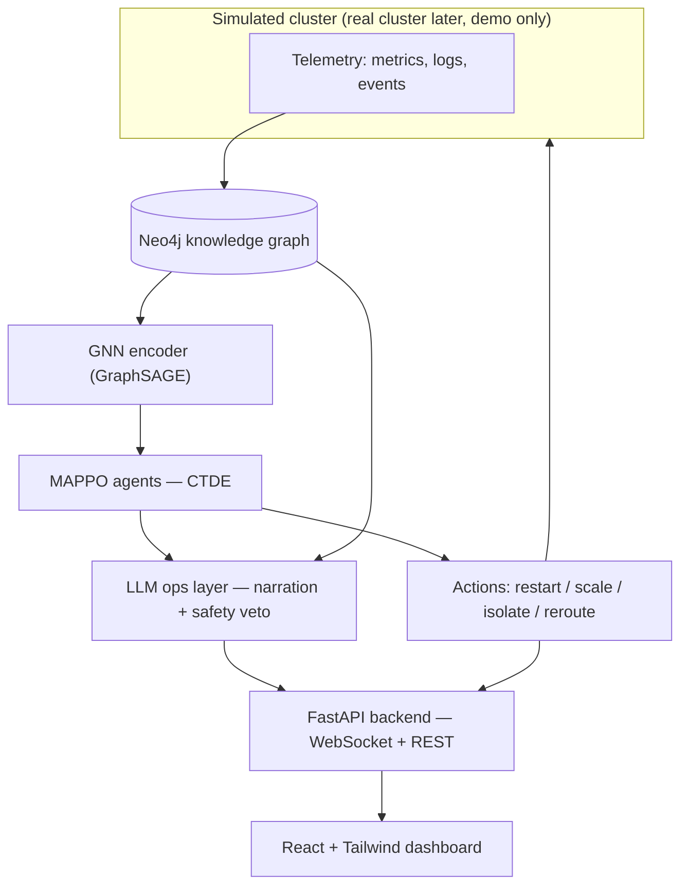

# Aegis — Implementation Plan

A multi-agent RL system for cluster self-healing: Neo4j knowledge graph → GNN state encoder → MAPPO cooperative agents → LLM ops layer, with a custom dashboard (not Streamlit) on top. This document is the working plan for building it end-to-end with Claude Code.

**How to use this**: work top to bottom through Phases 0–8. Each phase names the Claude Code subagent that owns it and links to a ready-to-paste prompt in §6. §5 has the actual subagent/skill files to create before you start Phase 0.

**Assumptions this plan makes** — flag anything you want changed before starting:
- RL trains against a **custom Python simulator**, not a real cluster. Training needs millions of environment steps; a real Kubernetes cluster is far too slow and risky for that. A real cluster shows up later (Phase 8) purely as a demo layer.
- The LLM ops layer defaults to a **local model via Ollama** (matching your existing local-LLM setup) behind a swappable adapter, with the **Gemini API** as the one-line swap-in for the polished demo (you have Gemini API access, not Claude API — Claude Code itself runs fine on your Pro subscription, that's a separate thing).
- Frontend is **React + Vite + Tailwind**, not Streamlit, per your direction.
- Deployment defaults to **free-tier infrastructure** since training doesn't need to run continuously. An AWS-based alternative is noted in §8 if you'd rather build that skill instead.
- Subagent `model` fields are set to `inherit` rather than pinned to a specific model, since Opus isn't available on the Claude Pro plan. If you're on the main session with a strong model selected, the harder subagents (`gnn-architect`, `rl-trainer`) inherit it; if you ever move to Max, you can pin those two to `opus` explicitly since they benefit most from it.

---

## Contents
1. [Architecture at a glance](#1-architecture-at-a-glance)
2. [Repository structure](#2-repository-structure)
3. [Phased roadmap](#3-phased-roadmap)
4. [Claude Code setup: CLAUDE.md](#4-claude-code-setup-claudemd)
5. [Subagents](#5-subagents)
6. [Skills](#6-skills)
7. [Plugins and MCP servers](#7-plugins-and-mcp-servers)
8. [Prompt playbook](#8-prompt-playbook)
9. [The UI: modern, minimalist, not Streamlit](#9-the-ui-modern-minimalist-not-streamlit)
10. [Deployment](#10-deployment)
11. [Definition of done / portfolio checklist](#11-definition-of-done--portfolio-checklist)

---

## 1. Architecture at a glance



Seven layers, in data-flow order:

1. **Simulated cluster** — services, pods, nodes; injects faults (crashes, CPU spikes, network partitions, cascading latency) on a seed.
2. **Neo4j knowledge graph** — the live state representation. Nodes = services/pods/nodes; edges = dependencies and call relationships with their metrics.
3. **GNN encoder** — turns graph neighborhoods into fixed-size embeddings: one per agent (local observation), one pooled (critic input).
4. **MAPPO agents** — centralized-training, decentralized-execution (CTDE) cooperative RL: each agent acts on its local embedding, a shared critic sees the global one.
5. **LLM ops layer** — parses noisy logs into graph-update events, narrates *why* an agent acted (grounded in real graph facts, not invented), and can veto an action against a short list of operating policies.
6. **Backend** — FastAPI, streaming live graph state, actions, and narratives over WebSocket.
7. **Frontend** — the dashboard; see §9.

The two artifacts that matter most for interviews live in the middle: the **MAPPO-vs-baseline comparison** (proves the RL actually earns its keep) and the **grounded narration** (proves the LLM layer isn't decorative).

---

## 2. Repository structure

```
aegis/
├── CLAUDE.md
├── PLAN.md                        # this document
├── .claude/
│   ├── agents/
│   │   ├── sim-engineer.md
│   │   ├── graph-engineer.md
│   │   ├── gnn-architect.md
│   │   ├── rl-trainer.md
│   │   ├── ops-llm-layer.md
│   │   └── frontend-builder.md
│   └── skills/
│       ├── aegis-architecture/SKILL.md
│       ├── train-episode/SKILL.md
│       ├── sync-graph-schema/SKILL.md
│       └── generate-incident-narrative/SKILL.md
├── simulator/                      # Phase 1
│   ├── cluster_env.py              # PettingZoo ParallelEnv API
│   ├── fault_injection.py
│   └── topology_generator.py
├── graph/                          # Phase 2
│   ├── schema.cypher
│   ├── migrations/
│   └── ingestion_pipeline.py
├── encoder/                        # Phase 3
│   ├── gnn_model.py                # GraphSAGE / GAT
│   └── probe.py                    # linear-probe validation
├── marl/                           # Phase 4
│   ├── mappo.py
│   ├── reward.py
│   ├── baseline.py                 # rule-based controller to beat
│   ├── train.py
│   └── checkpoints/
├── ops_layer/                      # Phase 5
│   ├── llm_client.py               # Ollama / Claude API adapter
│   ├── log_parser.py
│   ├── narrator.py
│   └── safety_supervisor.py
├── backend/                        # Phase 6
│   ├── main.py
│   ├── ws.py
│   └── models.py
├── frontend/                       # Phase 7
│   ├── src/
│   │   ├── components/
│   │   │   ├── ClusterGraph.tsx
│   │   │   ├── IncidentFeed.tsx
│   │   │   └── MetricsPanel.tsx
│   │   ├── App.tsx
│   │   └── main.tsx
│   ├── tailwind.config.ts
│   └── package.json
├── demo/                           # Phase 8 — real-cluster demo mode
│   ├── kind-cluster.yaml
│   └── chaos-experiments/
├── tests/
├── docker-compose.yml              # local Neo4j for dev
└── README.md
```

---

## 3. Phased roadmap

| Phase | Goal | Key deliverable | Owning agent |
|---|---|---|---|
| 0 | Foundations | Repo scaffolding, CLAUDE.md, local dev environment (docker-compose Neo4j) | main session |
| 1 | Simulated cluster | Fault-injectable, seedable, PettingZoo-style multi-agent env | `sim-engineer` |
| 2 | Knowledge graph | Schema + ingestion pipeline, live-synced to the simulator | `graph-engineer` |
| 3 | GNN encoder | GraphSAGE encoder, validated with a linear probe | `gnn-architect` |
| 4 | MAPPO training | CTDE policy that beats a rule-based baseline on recovery time and SLA violations | `rl-trainer` |
| 5 | LLM ops layer | Grounded action narration + safety-veto supervisor | `ops-llm-layer` |
| 6 | Serving backend | FastAPI + WebSocket streaming of state, actions, narratives | main session |
| 7 | Frontend | React + Tailwind dashboard (§9) | `frontend-builder` |
| 8 | Integration & demo | End-to-end wiring, optional real-cluster demo (kind + Chaos Mesh), deploy | main session |

### Phase 1 — Simulated cluster
Why simulate at all: MAPPO needs millions of environment steps, which a real cluster can't give you fast or safely. Build `simulator/` to the **PettingZoo `ParallelEnv`** API (`reset`, `step`, per-agent `observation_space`/`action_space`) so it plugs into `marl/` unmodified and stays compatible with off-the-shelf MARL libraries if you ever want a second implementation to compare against. Faults (pod crash, node CPU/memory spike, network partition, cascading latency) must be configurable and reproducible from a single seed. Favor a CPU-fast, vectorizable implementation — this environment gets stepped millions of times.

**Done when**: fault scenarios are reproducible from a seed, and you have a throughput number (episodes/sec) so you know whether Phase 4 will be bottlenecked here.

### Phase 2 — Knowledge graph
Schema:
```cypher
(:Service)-[:DEPENDS_ON]->(:Service)
(:Pod)-[:INSTANCE_OF]->(:Service)
(:Pod)-[:RUNS_ON]->(:Node)
(:Service)-[:CALLS {p99_latency_ms, error_rate}]->(:Service)
```
Node properties (health, cpu_pct, mem_pct, restart_count) update every simulation tick. The ingestion pipeline reads the simulator's event stream and `MERGE`s updates into Neo4j — idempotent by construction, since the simulator can replay or restart. Give `graph-engineer` direct Neo4j access via MCP (§7) so Cypher gets tested against a live dev instance instead of written blind.

**Done when**: the graph stays in sync with simulator state at low latency, and every schema change is a numbered migration.

### Phase 3 — GNN encoder
GraphSAGE is the default over GAT: it's inductive, meaning it generalizes to graphs with a different number of nodes than it trained on — important here, since pods scale in and out and the encoder can't assume a fixed graph size. Output is a per-node embedding (agent observation) plus a pooled global embedding (critic input). Before wiring this into `marl/`, validate it in isolation: train a linear probe that predicts node health status from the frozen embeddings. If the probe can't beat a trivial baseline, fix the encoder before you're also debugging RL on top of it.

**Done when**: the linear probe passes, on both the training-time graph sizes and a few held-out sizes.

### Phase 4 — MAPPO training
CTDE: a centralized critic sees the pooled global embedding, decentralized actors each see only their own GNN-encoded local neighborhood. Action space per agent: `{no-op, restart, scale_up, scale_down, isolate, reroute}`. Reward has a dense component (SLA-violating requests, weighted restart/scale cost) and a sparse terminal bonus for full recovery within budget — **log every reward term separately**, never as one collapsed scalar; reward hacking is the most common failure mode in this kind of system and separated logs are how you catch it early. Hand-roll MAPPO with CTDE and GAE on PyTorch rather than reaching straight for RLlib — it's a stronger interview signal, and RLlib remains a reasonable fallback if hyperparameter search eats too much time. Build `marl/baseline.py` — a simple threshold-triggered rule-based controller — before or alongside the MAPPO policy; without it you have no way to prove the RL is actually doing something.

**Done when**: MAPPO measurably beats the baseline on time-to-recovery and SLA-violation count, on multiple fault scenarios, not just the one it was tuned on.

### Phase 5 — LLM ops layer
Three pieces, all behind an `LLMClient` protocol so Ollama and the Gemini API are interchangeable:
- **Log parser** — noisy log lines → structured graph-update events.
- **Narrator** — after each action, a 1–2 sentence explanation grounded *only* in the real dependency edges and metrics that triggered it. Pass the actual graph facts into the prompt and instruct the model to cite only those — this is what keeps the narration from becoming a plausible-sounding hallucination.
- **Safety supervisor** (the strongest differentiator here) — an LLM check that can veto an RL action against a short list of operating policies the RL agent has no way to know about on its own (e.g., don't restart during a scheduled deploy window). This is the "RL decides, an agentic layer can override" story, and it's genuinely uncommon in portfolio projects.

**Done when**: narrations spot-check clean against the actual action log (no invented causes), and the supervisor has vetoed at least one action in testing — proving it isn't a no-op.

### Phase 6 — Serving backend
FastAPI + WebSocket, building on the async/FastAPI experience you already have. `/ws/live` streams node state, actions, and narratives; `/api/episodes/{id}` replays a completed run; `/api/metrics` serves training curves for the dashboard.

### Phase 7 — Frontend
Covered in full in §9.

### Phase 8 — Integration, demo, deploy
Wire every layer together end-to-end first. Then, purely for the portfolio demo — not for training — stand up a `kind` (Kubernetes-in-Docker) cluster with Chaos Mesh for fault injection, and map the trained policy's decisions onto real `kubectl` actions through a thin adapter. Keep this fully decoupled from the training loop; it only needs to run once, for the recording.

---

## 4. Claude Code setup: CLAUDE.md

```markdown
# Aegis — Multi-Agent RL for Cluster Self-Healing

## What this is
Multi-agent RL that learns to diagnose and heal failures in a simulated
(later real, demo-only) Kubernetes-like cluster. Full design: PLAN.md.

## Stack
- Simulator: pure Python, PettingZoo ParallelEnv API
- Graph: Neo4j (schema: graph/schema.cypher)
- Encoder: PyTorch Geometric, GraphSAGE
- RL: hand-rolled MAPPO (CTDE + GAE), PyTorch
- LLM ops layer: LLMClient protocol (ops_layer/llm_client.py) —
  Ollama by default, Gemini API via GEMINI_API_KEY for the demo build
- Backend: FastAPI + WebSocket
- Frontend: React + Vite + Tailwind — NOT Streamlit, see PLAN.md §9

## Non-negotiable conventions
- Every reward component is logged separately (marl/reward.py) — never
  collapse them into one scalar.
- Every MAPPO run is compared against marl/baseline.py. Not "done"
  until it beats the baseline on recovery time and SLA violations.
- LLM narrations must cite only real graph facts passed into the
  prompt — no invented causes.
- Cypher migrations are numbered files under graph/migrations/.
- Run `pytest tests/` before considering any phase done.

## Where to look
- Full phased plan: PLAN.md
- Reward design rationale: marl/reward.py docstring
- Graph schema: graph/schema.cypher
```

---

## 5. Subagents

Create these under `.claude/agents/`. Each one keeps a phase's context — and its verbose output (training logs, Cypher iteration, etc.) — out of your main conversation.

**`sim-engineer.md`**
```yaml
---
name: sim-engineer
description: Builds and maintains the simulated cluster environment (simulator/) — topology generation, fault injection, and the PettingZoo-style multi-agent API. Use for anything under simulator/.
tools: Read, Write, Edit, Bash, Grep, Glob
model: inherit
---

You own `simulator/`. This is a pure-Python, CPU-fast, seedable
multi-agent environment representing a cluster of services, pods, and
nodes.

Requirements:
- Implement the PettingZoo ParallelEnv API (reset, step,
  observation_space, action_space) so it plugs into marl/ unmodified.
- Faults must be configurable and reproducible from a single seed:
  pod crashes, node CPU/memory spikes, network partitions, cascading
  latency.
- Favor a vectorized/batched step if it doesn't hurt readability —
  this environment will be stepped millions of times during training.
- Every fault scenario needs a fixture test in tests/simulator/.

Report throughput (episodes/sec on this machine) after any change that
could affect it, so we can track whether the simulator is fast enough
for training.
```

**`graph-engineer.md`**
```yaml
---
name: graph-engineer
description: Owns the Neo4j knowledge graph — schema, migrations, and the ingestion pipeline that keeps the graph synced with simulator telemetry. Use for anything under graph/.
tools: Read, Write, Edit, Bash, Grep, Glob
mcpServers:
  - neo4j:
      type: stdio
      command: <exact launch command from your chosen Neo4j MCP server's README — see §7>
      args: []
      env:
        NEO4J_URI: "bolt://localhost:7687"
        NEO4J_USERNAME: "neo4j"
        NEO4J_PASSWORD: "${NEO4J_PASSWORD}"
---

You own the knowledge graph in `graph/`:
(Service)-[:DEPENDS_ON]->(Service)
(Pod)-[:INSTANCE_OF]->(Service)
(Pod)-[:RUNS_ON]->(Node)
(Service)-[:CALLS {p99_latency_ms, error_rate}]->(Service)

You have direct Neo4j access via MCP — use it to test Cypher against
the live dev database before committing it to graph/schema.cypher or
graph/ingestion_pipeline.py. Every schema change is a numbered file
under graph/migrations/. Ingestion writes must be idempotent (MERGE,
never bare CREATE).
```

**`gnn-architect.md`**
```yaml
---
name: gnn-architect
description: Designs and trains the GNN state encoder (encoder/) that turns the Neo4j graph into agent observation embeddings. Use for anything under encoder/.
tools: Read, Write, Edit, Bash, Grep, Glob
model: inherit
---

You own `encoder/`, built on PyTorch Geometric. Default architecture:
GraphSAGE — it's inductive, so it generalizes to graphs with a
different node count than it trained on, which matters here since pods
scale in and out. Output: one embedding per node (agent observation)
plus a pooled global embedding (critic input).

Before wiring a new encoder version into marl/, validate it standalone
in encoder/probe.py: train a linear probe predicting node health status
(healthy/degraded/critical) from the frozen embeddings. If the probe
can't beat a trivial baseline, the encoder isn't ready — fix that
before touching marl/, rather than debugging GNN and RL problems at
the same time.
```

**`rl-trainer.md`**
```yaml
---
name: rl-trainer
description: Owns the MAPPO multi-agent training loop, reward shaping, and evaluation against the rule-based baseline. Use for anything under marl/.
tools: Read, Write, Edit, Bash, Grep, Glob
model: inherit
---

You own `marl/` — hand-rolled MAPPO (CTDE: centralized critic over the
pooled graph embedding, decentralized actors over each agent's local
GNN embedding, GAE for advantage estimation).

Non-negotiables:
- Log every reward component separately (SLA violations, action cost,
  terminal bonus) — never collapse them into one scalar. Reward
  hacking is the most common failure mode here; separated logs are how
  we catch it early.
- Every run is compared against marl/baseline.py. A run isn't done
  until it beats the baseline on time-to-recovery and SLA-violation
  count, across more than one fault scenario.
- Checkpoint every N episodes to marl/checkpoints/ alongside the
  config that produced it, so runs are reproducible.

Report reward curves and the baseline comparison after every run, not
just a final number.
```

**`ops-llm-layer.md`**
```yaml
---
name: ops-llm-layer
description: Builds the LLM ops layer (ops_layer/) — structured log extraction, action narration grounded in graph facts, and the safety-supervisor veto. Use for anything under ops_layer/.
tools: Read, Write, Edit, Bash, Grep, Glob
---

You own `ops_layer/`. Everything goes through the LLMClient protocol
in ops_layer/llm_client.py so the backing model is swappable — Ollama
locally by default, the Gemini API via GEMINI_API_KEY for the
polished demo — without touching call sites.

Three responsibilities:
1. log_parser.py — noisy log lines → structured graph-update events.
2. narrator.py — a 1-2 sentence explanation per action, grounded in
   the real dependency edges and metrics that triggered it. Pass those
   facts into the prompt and instruct the model to cite only them —
   never let it invent a cause.
3. safety_supervisor.py — vetoes an RL action against a short list of
   operating policies (e.g. no restarts during a deploy window). Log
   every veto with its stated reason.
```

**`frontend-builder.md`**
```yaml
---
name: frontend-builder
description: Builds the dashboard (frontend/) — React + Vite + Tailwind. Use for anything under frontend/. Never propose Streamlit or a generic admin-template layout.
tools: Read, Write, Edit, Bash, Grep, Glob
---

You own `frontend/` — React + Vite + Tailwind. No Streamlit, no generic
dashboard template. Design direction (full token system in PLAN.md §9):

- Dark "ops room" aesthetic. The live cluster graph is the hero
  element, not one card among several.
- Node color is functional, not decorative — it IS the health signal,
  not a palette choice layered on top of it.
- A restrained accent palette and a deliberate type pairing (not the
  default system font stack); generous whitespace.

Components:
- ClusterGraph.tsx — the live force-directed graph (library choice in
  PLAN.md §9)
- IncidentFeed.tsx — streaming narrated timeline from the LLM ops layer
- MetricsPanel.tsx — reward curves, MTTR, SLA compliance over time

Before calling any component done, take a screenshot and check it
against the token system in PLAN.md §9 — cut anything that doesn't
earn its place.
```

---

## 6. Skills

Create these under `.claude/skills/<name>/SKILL.md`.

**`aegis-architecture`** — background knowledge, loads automatically whenever it's relevant so every subagent and session shares the same mental model without you repeating it:
```yaml
---
name: aegis-architecture
description: Background on Aegis's architecture and conventions — layer order, reward-logging rules, and the LLMClient adapter pattern. Relevant anywhere in this repo.
---

Data-flow order: simulator -> Neo4j graph -> GNN encoder -> MAPPO
agents -> actions -> LLM ops layer -> backend -> frontend.

Conventions:
- Reward components are always logged separately (marl/reward.py).
- All LLM calls go through the LLMClient protocol
  (ops_layer/llm_client.py) so Ollama and the Gemini API are
  interchangeable.
- Cypher migrations are numbered files in graph/migrations/.
- Never propose Streamlit for the frontend.
```

**`train-episode`** — a task skill, run in a forked subagent since training output is long and shouldn't flood your main conversation:
```yaml
---
name: train-episode
description: Run one MAPPO training iteration and report reward curves against the baseline. Use to kick off or check on training.
context: fork
agent: rl-trainer
disable-model-invocation: true
---

Run one training iteration:
1. Launch marl/train.py with the current config
2. Wait for it to finish (or hit the configured episode budget)
3. Report each reward component separately, wall-clock time, and the
   comparison against marl/baseline.py
4. Save a checkpoint and note its path
```

**`sync-graph-schema`**:
```yaml
---
name: sync-graph-schema
description: Regenerate and apply a Neo4j migration after the graph schema changes. Use after editing graph/schema.cypher.
disable-model-invocation: true
---

1. Diff graph/schema.cypher against the latest file in graph/migrations/
2. Write the next numbered migration capturing only the delta
3. Apply it to the local dev database
4. Update graph/ingestion_pipeline.py if the change affects what
   ingestion writes
```

**`generate-incident-narrative`**:
```yaml
---
name: generate-incident-narrative
description: Generate a human-readable incident narrative for a completed training episode, grounded in its actual action log and graph state.
context: fork
agent: ops-llm-layer
disable-model-invocation: true
---

Take the episode ID passed as $ARGUMENTS:
1. Pull the episode's action log and the graph state at each action
2. For each action, write a 1-2 sentence explanation grounded only in
   the real dependency edges and metrics at that point — no invented
   causes
3. Assemble the narratives into a single incident timeline
```

---

## 7. Plugins and MCP servers

**Neo4j MCP server** — scope it to `graph-engineer` only (via the `mcpServers` field shown in §5), not project-wide in `.mcp.json`. That way its tool definitions don't consume context in your main conversation or any other subagent. A couple of concrete options to pick from:
- `cxt9/neo4j-mcp` — ships as both a standalone MCP server and a Claude Code plugin manifest, which is the most turnkey path if you'd rather install it as a plugin than hand-write the `mcpServers` block.
- Neo4j's own official MCP servers (listed in the standard MCP servers registry) are another option.

Whichever you pick, grab the exact `command`/`args` from its README — these move fast enough that I'd rather not hand you a possibly-stale invocation with false confidence. The shape that matters is what's already in §5: scoped to one subagent, credentials via environment variables, never hardcoded.

**Official Anthropic marketplace** (`claude-plugins-official`, auto-registered on first interactive launch — browse it with `/plugin marketplace`): worth installing a security-review / secret-scanning plugin from it before you commit anything, since this repo holds Neo4j credentials and an API key. Also worth a code-intelligence plugin for Python and TypeScript, since the project spans both. Exact plugin names shift as the catalog changes, so check what's currently listed rather than me guessing a slug.

**`skill-creator`** (same marketplace) — useful once `train-episode` and `generate-incident-narrative` exist: it runs an eval loop that checks whether a skill triggers on the prompts it should and whether its output holds up, which is a nice way to sanity-check these two before you rely on them for the demo recording.

---

## 8. Prompt playbook

Paste these into Claude Code once the corresponding subagents/skills exist.

**Phase 0**: "Set up the Aegis repo scaffolding from PLAN.md §2. Create CLAUDE.md from §4, and the subagent and skill files from §5 and §6 exactly as written."

**Phase 1**: "Use the sim-engineer subagent to build the multi-agent cluster environment per PLAN.md §3 Phase 1. Start with topology generation and a single fault type (pod crash), then add the rest once tests pass."

**Phase 2**: "Use the graph-engineer subagent to stand up the Neo4j schema from PLAN.md §3 Phase 2 and wire the ingestion pipeline to the simulator's event stream."

**Phase 3**: "Use the gnn-architect subagent to build the GraphSAGE encoder per PLAN.md §3 Phase 3, including the linear-probe validation before it's considered ready."

**Phase 4**: "Use the rl-trainer subagent to implement MAPPO and the rule-based baseline per PLAN.md §3 Phase 4. Then run /train-episode."

**Phase 5**: "Use the ops-llm-layer subagent to build the LLMClient adapter and narrator per PLAN.md §3 Phase 5, defaulting to Ollama."

**Phase 6**: "Build the FastAPI backend per PLAN.md §3 Phase 6 — WebSocket stream of live state, actions, and narratives."

**Phase 7**: "Use the frontend-builder subagent to build the dashboard per PLAN.md §9. Screenshot ClusterGraph and check it against the token system before starting IncidentFeed."

**Phase 8**: "Wire every layer together end-to-end. Then research the fastest path to a kind + Chaos Mesh demo cluster and map the trained policy's actions to kubectl — keep this fully separate from the training loop."

---

## 9. The UI: modern, minimalist, not Streamlit

**Why not Streamlit**: it's genuinely good for internal tools and prototyping, but it reads instantly as "internal tool" — a sidebar of widgets, default fonts, a card grid. For a piece meant to demonstrate product and systems thinking on top of the RL work, a small custom frontend signals more than the RL system alone does.

**Token system**:
- **Color** (four to six named values, all functional, none decorative): near-black background `#0B0E14`; health scale — healthy `#3DDC97` (muted teal), degraded `#F5A623` (amber), critical `#E5484D` (controlled red); one neutral for UI chrome, a cool blue-gray `#7C89A3`.
- **Type**: a monospace/semi-monospace face (e.g. IBM Plex Mono or JetBrains Mono) for data — node IDs, timestamps, metrics — paired with a clean humanist sans (e.g. IBM Plex Sans or Inter) for narrative prose. The pairing itself should read as "ops tool," not "generic SaaS dashboard."
- **Layout**: the graph is the canvas, not one panel among equals. The incident feed and metrics panel are docked, collapsible side panels rather than cells in a 12-column grid — that hierarchy is the actual layout decision, not a default template.
- **Signature element**: nodes pulse briefly when an agent acts on them, and the specific dependency edge the LLM narrator cites for that action traces with a brief animated highlight. This ties the one moment of motion directly to what the system is actually doing — the causal path behind a decision — rather than being decoration layered on top.
- **Motion**: spent once, on that pulse-and-trace moment. Everywhere else stays still.

**Stack**:
- React + Vite + TypeScript + Tailwind.
- Graph rendering: reach for D3's force simulation directly rather than a higher-level wrapper — the pulse-and-trace signature needs animation control that a prebuilt graph component will fight you on.
- Charts: `recharts` for the metrics panel. This one's meant to be unremarkable, so a plain, reliable choice is the right call.
- State: the WebSocket stream feeds a small React context + `useReducer` store — no need for Redux at this scale.

---

## 10. Deployment

Training doesn't need to run continuously, so the always-on footprint is small:
- **Training**: local, or free-tier GPU via Google Colab / Kaggle notebooks — not a hosted service.
- **Neo4j**: AuraDB Free tier.
- **Backend**: Render or Fly.io free web service (both support WebSocket).
- **Frontend**: Vercel or Netlify free tier.
- **Real-cluster demo (Phase 8)**: run `kind` locally just for the recording — no need to keep a Kubernetes cluster deployed anywhere.

This whole stack runs at $0 ongoing cost; the only real compute need is a handful of free-tier GPU hours for training. If you'd rather build AWS reps for interviews than optimize for free-tier convenience, the pieces map over directly — Neo4j to a small EC2 instance or Neptune, the backend to a single EC2 instance or an ECS Fargate task behind an ALB, frontend to S3 + CloudFront. Say the word if you want that version written out instead.

---

## 11. Definition of done / portfolio checklist

- [ ] Simulator produces reproducible fault scenarios at a throughput that supports real training
- [ ] Neo4j graph stays synced with simulator state in real time
- [ ] GNN encoder passes the linear-probe sanity check
- [ ] MAPPO measurably beats the rule-based baseline on recovery time and SLA violations, across more than one fault scenario — this comparison is the single most interview-relevant artifact in the project
- [ ] LLM narrations spot-check clean against the real action log — no invented causes
- [ ] Safety supervisor has vetoed at least one action in testing
- [ ] Dashboard: the graph is the hero, not a stat-card grid; screenshots checked against the token system in §9
- [ ] One continuous recording: inject a fault, watch the graph react, watch the incident feed narrate it
- [ ] README documents the architecture, the baseline-comparison numbers, and links the demo video
- [ ] (Stretch, strong differentiator) Real-cluster demo mode via kind + Chaos Mesh, recorded once for the portfolio video
