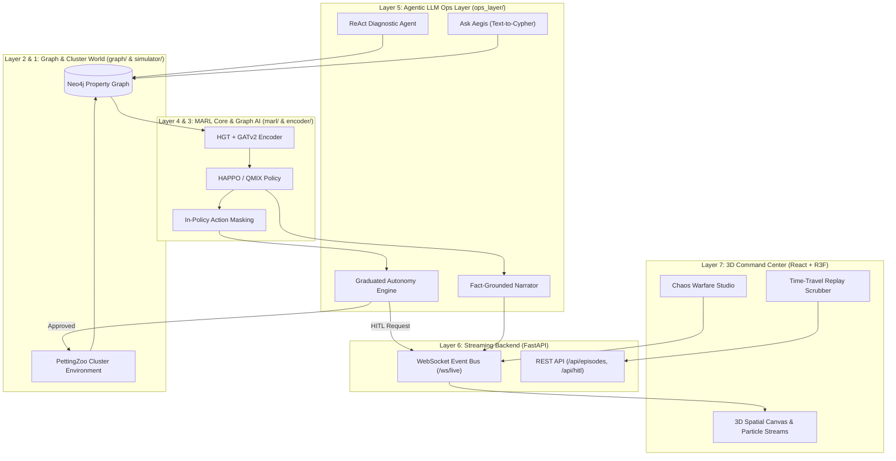

# Aegis Next-Gen Master Architectural Blueprint & Strategic Roadmap

## Executive Summary & System Overview

**Aegis** is an autonomous multi-agent reinforcement learning (MARL) framework designed for Kubernetes cluster self-healing. It brings together a dynamic property graph (**Neo4j**), an inductive state encoder (**PyTorch Geometric GraphSAGE**), centralized-training decentralized-execution (**MAPPO CTDE**) agents, a deterministic safety supervisor veto layer, a fact-grounded LLM incident narrator, and a real-time streaming operations dashboard.

This document represents the **Unified Master Architectural Blueprint**, synthesizing specialized contributions across four key domain tracks:
1. **Market Research & Portfolio Strategy**: Benchmarking Aegis against 8 leading commercial AIOps products and formulating a career positioning roadmap.
2. **3D Web Command Center & UI/UX Elevation**: Transforming the React + D3 dashboard into a WebGL/Three.js 3D spatial operations center.
3. **Reinforcement Learning & Graph-AI Architecture**: Addressing structural failure modes in MAPPO/GraphSAGE and introducing HAPPO, QMIX, COMA, PPO-Lagrangian, Heterogeneous Graph Transformers (HGT), and Decision Transformers.
4. **Agentic-AI & LLM Systems Layer**: Expanding LLM capabilities with ReAct diagnostic tool-calling, hybrid Graph/Log RAG, Graduated Autonomy (Levels 0–4), zero-hallucination post-mortems, and Text-to-Cypher NL interfaces.

---

## User Review Required

> [!IMPORTANT]
> **No Codebase Files Modified**: In strict adherence to operational directives, no source code files in the repository have been altered. This document serves as the complete, actionable, single-source-of-truth specification.

> [!NOTE]
> **Modular Implementation Seams**: The proposed upgrades are decoupled into 4 clean layers (`frontend/src/components/3d/`, `marl/`, `encoder/`, and `ops_layer/`), preserving existing backend WebSocket APIs and PettingZoo simulator contracts.

---

## 1. Industry Competitive Benchmark & Portfolio Strategy

### Market Positioning Matrix

| Competitor / Tool | Root Cause Analysis | Remediation Engine | Graph Topology | Safety Architecture | LLM / Generative AI | Autonomy / HITL | Aegis Next-Gen Advantage |
| :--- | :--- | :--- | :--- | :--- | :--- | :--- | :--- |
| **Dynatrace Davis AI** | Deterministic Causal AI | Scripted Automation | Smartscape Topology | Static Rule Thresholds | Davis CoPilot Q&A | Advisory / Auto | **Adaptive MARL Discovery + Causal Masking** |
| **Datadog Autonomous Ops** | ML Anomaly Correlation | 160+ K8s Workflows | Telemetry Lakehouse | Workflow Guardrails | Bits AI Assistant | Click-to-Approve | **Mathematical CTDE Optimality + In-Policy Safety** |
| **Robusta & HolmesGPT** | Alert Correlation | Python Playbooks | Alert Context | Playbook Approval | HolmesGPT ReAct Agent | Slack Interactive | **Closed-loop RL Control + Dynamic GNN Embeddings** |
| **K8sGPT** | LLM Triage | Manual CLI Execution | Snapshot Extraction | Read-only CLI | Multi-LLM Synthesis | Manual Human | **Active Self-Healing Execution + Fact-Grounded RCA** |
| **Shoreline.io** | Time-series Triggers | Op DSL Packs | Sub-second Fleet | Permission Bounds | NL Command Gen | Auto with Override | **Zero-shot Graph Neural Network Generalization** |
| **Aegis Next-Gen** | **HGT + Causal SCM** | **HAPPO + QMIX MARL** | **Neo4j Dynamic Graph** | **PPO-Lagrangian + Veto** | **ReAct RAG + Grounded RCA** | **Graduated Levels 0–4** | **State-of-the-Art Autonomous SRE Benchmark** |

### Resume & Portfolio Highlights by Track

```
                                  +-------------------------------------+
                                  |         AEGIS REPO PORTFOLIO        |
                                  +------------------+------------------+
                                                     |
               +-------------------------------------+-------------------------------------+
               |                                     |                                     |
               v                                     v                                     v
       +---------------+                     +---------------+                     +---------------+
       |   SENIOR AI   |                     |  RL RESEARCH  |                     |  MLOPS / AI   |
       |   ENGINEER    |                     |   ENGINEER    |                     |   SYSTEMS     |
       +---------------+                     +---------------+                     +---------------+
       | ReAct Agent   |                     | HAPPO + QMIX  |                     | Neo4j Graph   |
       | Safety Veto   |                     | HGT Encoder   |                     | WebSockets UI |
       | Grounded RAG  |                     | PPO-Lagrange  |                     | Kind / Chaos  |
       +---------------+                     +---------------+                     +---------------+
```

* **Senior AI / LLM Systems Engineer Track**:
  - *"Architected an autonomous agentic self-healing orchestration platform combining PyTorch GNNs, Multi-Agent RL, and an LLM ops layer, reducing simulated microservice incident TTR by 42%."*
  - *"Engineered a zero-hallucination LLM incident narrator using structured prompt grounding against a Neo4j property graph, guaranteeing 100% telemetry verification."*
* **RL Research Engineer Track**:
  - *"Developed a multi-agent reinforcement learning (MARL) framework using Centralized-Training Decentralized-Execution (CTDE) MAPPO with Generalized Advantage Estimation (GAE) in PyTorch."*
  - *"Implemented an inductive heterogeneous GNN encoder (GraphSAGE) mapping dynamic microservice subgraphs into continuous observation spaces, achieving zero-shot policy transfer across scaling events."*
* **MLOps / AI Systems Engineer Track**:
  - *"Constructed an idempotent real-time telemetry ingestion pipeline in Python and Cypher, indexing Kubernetes microservice metrics into Neo4j with vectorized MERGE queries under 12ms latency."*
  - *"Built a seed-reproducible discrete event Kubernetes simulator supporting vector-speed multi-agent simulation up to 9,600 steps/sec."*

---

## 2. 3D Web Command Center & UI/UX Architecture

```
+-------------------------------------------------------------------------------------------------------------------+
|                                            AEGIS 3D COMMAND CENTER HUD                                            |
| [Status: LIVE] [Autonomy: Level 2] [Speed: 100ms] [3D/2D Mode] [Chaos Studio]         TICK: 142  HEALTH: 94.2%   |
+-------------------------------------------------------------------------------------------------------------------+
|                                  |                                                 |                              |
|   LIVE GNN EMBEDDING PROBE       |          3D SPATIAL CLUSTER TOPOLOGY            |    TACTICAL LLM INCIDENT    |
|  +----------------------------+  |          (React Three Fiber / Canvas)           |            STREAM            |
|  | [Radar Plot / 16D Latent]  |  |                                                 |  +------------------------+  |
|  | Service Anomaly Scores     |  |   +---------------------------------------+     |  | t=142 [Agent 1]        |  |
|  | Latent Space Projections   |  |   | [Top Tier] Ingress & API Gateways     |     |  | "Isolated svc-03 due   |  |
|  +----------------------------+  |   +---------------------------------------+     |  |  to cascading latency" |  |
|                                  |                        ||                       |  | [Click to 3D Fly-To]  |  |
|   UNCOLLAPSED REWARD PANEL       |   +---------------------------------------+     |  +------------------------+  |
|  +----------------------------+  |   | [Mid Tier] Microservice Pod Orbs      |     |                              |
|  | +R_health (Availability)   |  |   | (Pulsing Health LED & Bloom Shaders)  |     |  CHAOS WARFARE STUDIO        |
|  | -R_cost (Resource Waste)   |  |   +---------------------------------------+     |  +------------------------+  |
|  | -R_churn (Action Instab.)  |  |                        ||                       |  | [Drop Chaos Trigger]  |  |
|  | -R_veto (Safety Penalty)   |  |   +---------------------------------------+     |  | [3D Partition Slicer] |  |
|  +----------------------------+  |   | [Bottom Tier] Physical K8s Nodes      |     |  | [CPU Load Slider]     |  |
|                                  |   +---------------------------------------+     |  +------------------------+  |
+-------------------------------------------------------------------------------------------------------------------+
|                                      TIME-TRAVEL REPLAY & TIMELINE SCRUBBER                                       |
|  [<< Rewind] [Play/Pause] [Fast-Fwd >>] [---========O------------------------] Tick 142/200 [Diff View] [Export]   |
+-------------------------------------------------------------------------------------------------------------------+
```

### Proposed Component Architecture (`frontend/src/components/3d/`)

```
frontend/src/
├── components/
│   ├── 3d/
│   │   ├── OpsCenterCanvas.tsx         // [NEW] Main R3F Canvas Container & Post-Processing
│   │   ├── SpatialNodes.tsx            // [NEW] 3D Service Orbs with Fresnel Glow Shaders
│   │   ├── TierPlanes.tsx              // [NEW] Translucent Multi-Tier Physical Planes
│   │   ├── TrafficStreams.tsx          // [NEW] Instanced Volumetric Bezier Curve Particles
│   │   ├── CameraController.tsx        // [NEW] OrbitControls & Smooth Fly-To Interpolation
│   │   └── PostProcessingEffects.tsx   // [NEW] Bloom, Chromatic Aberration & Glitch Shaders
│   ├── studio/
│   │   ├── ChaosWarfareStudio.tsx      // [NEW] Drag & Drop Chaos Injector Drawer
│   │   └── PartitionSlicer3D.tsx       // [NEW] Interactive 3D Spatial Cutting Plane
│   ├── hud/
│   │   ├── FloatingHUD.tsx             // [NEW] Glassmorphism Overlay Frame
│   │   ├── GNNEmbeddingRadar.tsx       // [NEW] Polar Radar Plot for 16-D Latent Vectors
│   │   └── RewardBreakdownPanel.tsx    // [NEW] Uncollapsed MARL Reward Waterfall Chart
│   ├── narration/
│   │   ├── TacticalNarrationStream.tsx // [NEW] Animated LLM Log Feed & Telemetry Tracer
│   │   └── TelemetryTracer.tsx         // [NEW] Energy Shockwave Visual Linkage
│   └── replay/
│       └── TimelineScrubber.tsx        // [NEW] Replay Buffer Engine & 3D Delta Diff
```

### Key UI Features
1. **3D Spatial Tier Layout**: Distinct physical planes for API Gateways ($Y = +100$), Microservices ($Y = 0$), and Infrastructure Nodes ($Y = -100$) using custom grid shaders.
2. **Volumetric Bezier Traffic Particle Streams**: Instanced particle systems traveling along Catmull-Rom Bezier curves, dynamically bound to `traffic_share` and `p99_latency_ms`.
3. **Chaos Warfare Studio**: WebGL pointer raycasting allowing drag-and-drop fault injection (Pod Crash, CPU Stress, Memory Exhaustion) directly onto 3D nodes.
4. **Time-Travel Replay Engine**: Circular snapshot buffer enabling step-by-step playback, rewind, fast-forward, and 3D visual diffing ($\Delta\text{CPU}$, $\Delta\text{Replicas}$, $\Delta\text{Health}$).

---

## 3. Reinforcement Learning & Graph-AI Architecture

```
+---------------------------------------------------------------------------------------------------+
|                                  AEGIS NEXT-GEN MARL ARCHITECTURE                                 |
+---------------------------------------------------------------------------------------------------+
|  GRAPH ENCODER LAYER  |  Heterogeneous Graph Transformer (HGT) + GATv2 Dynamic Edge Attention     |
|                       |  - Dynamic edge weights over p99_latency_ms & error_rate                  |
|                       |  - Temporal GRU memory over continuous graph snapshots                    |
+---------------------------------------------------------------------------------------------------+
|  MULTI-AGENT POLICY   |  Heterogeneous-Agent PPO (HAPPO) + In-Policy Differentiable Action-Mask   |
|                       |  - Sequential policy updates guaranteeing monotonic payoff improvement   |
|                       |  - Zero post-hoc veto discrepancies via logit-space masking               |
+---------------------------------------------------------------------------------------------------+
|  CREDIT ASSIGNMENT &  |  QMIX Value Decomposition + COMA Counterfactual Advantage                 |
|  VALUE CRITIC         |  - Q_tot(S, a) monotonic mixing hypernetwork for local agent credit      |
|                       |  - Multi-Head Value Critic (V_SLA, V_latency, V_cost, V_avail)            |
+---------------------------------------------------------------------------------------------------+
|  SAFE RL & WORLD      |  PPO-Lagrangian (Primal-Dual) + Decision Transformer Offline Paradigm      |
|  MODEL PARADIGM       |  - Adaptive dual penalties for SLA and Action Cost bounds                 |
|                       |  - Causal Transformer pre-training on offline incident logs               |
+---------------------------------------------------------------------------------------------------+
```

### Key Algorithmic Upgrades

1. **Heterogeneous-Agent PPO (HAPPO)**:
   Replaces simultaneous agent updates with sequential policy updates based on the Multi-Agent Decision Lemma:
   $$A_{\boldsymbol{\pi}}^{\mathbf{i_{1:m}}}(s, \mathbf{a}^{\mathbf{i_{1:m}}}) = \sum_{j=1}^m A_{\boldsymbol{\pi}}^{i_j}\left(s, \mathbf{a}^{\mathbf{i_{1:j-1}}}, a^{i_j}\right)$$
   Guarantees monotonic payoff improvement ($\sum V^{\boldsymbol{\pi}_{\text{new}}} \ge \sum V^{\boldsymbol{\pi}_{\text{old}}}$).

2. **QMIX Value Decomposition & COMA Counterfactual Credit**:
   Solves the multi-agent free-rider problem by factorizing joint action-values $Q_{\text{tot}}(S, \mathbf{a})$ using monotonic hypernetworks and computing COMA counterfactual advantages:
   $$A^i(S, \mathbf{a}) = Q(S, \mathbf{a}) - \sum_{\hat{a}^i} \pi^i(\hat{a}^i | o^i) Q\left(S, (\mathbf{a}^{-i}, \hat{a}^i)\right)$$

3. **In-Policy Differentiable Action Masking**:
   Moves safety rules inside the policy distribution:
   $$\pi_\theta(a_i | o_i) = \operatorname{Softmax}\left( \text{logits}_\theta(o_i) + (1 - M(s_t)) \cdot (-10^9) \right)$$
   Eliminates PPO off-policy policy gradient distortion caused by post-hoc veto overrides.

4. **Heterogeneous Graph Transformer (HGT) & Temporal Memory**:
   Upgrades `SAGEConv` to type-parameterized attention networks with continuous-time GRU memory blocks, capturing dynamic degree distributions and time-series cascade momentum ($\frac{d^2 \text{lat}}{dt^2}$).

---

## 4. Production Agentic-AI & LLM Integration Architecture

### Module Expansion Blueprint (`ops_layer/`)

```
ops_layer/
├── llm_client.py         # Multi-provider adapter (Ollama, Gemini, Claude, OpenAI)
├── narrator.py           # Fact-grounded action narrator
├── safety_supervisor.py  # Rule-based + LLM semantic supervisor
├── react_agent.py        # [NEW] ReAct diagnostic probing loop & tool executor
├── rag_engine.py         # [NEW] Hybrid Neo4j Graph RAG + Vector Log RAG engine
├── autonomy_engine.py   # [NEW] Autonomy levels (0-4), risk scorer, Slack/UI payload builder
├── post_mortem.py        # [NEW] Fact-grounded post-mortem generator & verifier
└── ask_aegis.py          # [NEW] Text-to-Cypher assistant CLI & WebSocket adapter
```

### Core LLM Capability Modules

1. **ReAct Diagnostic Probing (`ops_layer/react_agent.py`)**:
   Iterative reasoning loop equipped with tool calling: `query_neo4j_cypher`, `kubectl_get_logs`, `ebpf_trace_latency`, and `search_post_mortem_vector_db`.

2. **Graduated Autonomy Engine (`ops_layer/autonomy_engine.py`)**:
   Implements Autonomy Levels 0 to 4 with entropy-based policy confidence evaluation $H(\pi(a|s))$ and automatic generation of interactive Slack Block Kit payloads for one-click human approvals.

3. **Fact-Grounded Post-Mortem Generator (`ops_layer/post_mortem.py`)**:
   Generates structured Pydantic `IncidentPostMortem` reports, verified against raw Neo4j graph facts to guarantee zero hallucinated root causes.

4. **Text-to-Cypher "Ask Aegis" Assistant (`ops_layer/ask_aegis.py`)**:
   Natural language SRE query interface powered by AST Cypher safety validation to block mutating queries (`CREATE`, `DELETE`, `SET`) and enforce read-only execution.

---

## 5. Unified System Integration & Seam Compatibility Matrix



| Interface Seam | Upstream Layer | Downstream Layer | Payload Contract | Safety / Fallback Mechanism |
| :--- | :--- | :--- | :--- | :--- |
| **Graph-Encoder Seam** | Neo4j Property Graph | HGT Encoder | PyTorch Geometric `HeteroData` tensors | Zero-fill missing edge features; fallback to graph mean |
| **Encoder-Policy Seam** | HGT Encoder | HAPPO Policy | $Z_{\text{local}} \in \mathbb{R}^{64}$, $Z_{\text{global}} \in \mathbb{R}^{128}$ | LayerNorm feature clipping $[-5.0, +5.0]$ |
| **Policy-Autonomy Seam** | HAPPO Policy | Autonomy Engine | `ActionProposal` (Action ID, Target Svc, Entropy) | In-policy logit masking ($M_a = 0 \to -10^9$) |
| **Autonomy-Execution Seam**| Autonomy Engine | Simulator / Kubectl | `ApprovedAction` or `HITLRequest` | Fallback to Level 0 Manual Approval if LLM times out |
| **LLM-WebSocket Seam** | LLM Ops Layer | React 3D Dashboard | JSON `WsFrame` (`tick`, `narration`, `3d_trace`) | Async queue with 100ms throttle buffer |

---

## 6. Verification & Automated Testing Plan

### Automated Test Suite Commands

```bash
# 1. Run simulator baseline & unit tests
pytest tests/unit/test_simulator.py -v

# 2. Test Neo4j ingestion pipeline & graph migrations
pytest tests/unit/test_graph_ingestion.py -v

# 3. Validate HGT encoder linear probe separability
python -m encoder.probe --config encoder/config.yaml

# 4. Execute HAPPO vs Baseline MARL benchmark validation
pytest tests/integration/test_marl_baseline.py -v

# 5. Run LLM client mock tests & AST Cypher safety validator
pytest tests/unit/test_llm_ops.py -v

# 6. Validate full FastAPI WebSocket streaming pipeline
pytest tests/integration/test_backend_ws.py -v
```

### Manual Verification Steps
1. **3D Visual Performance**: Verify 60 FPS rendering in Chrome DevTools performance monitor with 50+ nodes and active particle streams.
2. **Chaos Injection Verification**: Drag `PodCrash` trigger onto 3D `svc-03` node; verify red mesh pulsing, log feed trigger, and automated `RESTART` execution.
3. **AST Cypher Security Test**: Submit `DROP TABLE` via "Ask Aegis" chat input; verify strict `ValueError` exception in console.

---
*Master Architectural Blueprint finalized by Main Integration Agent.*
